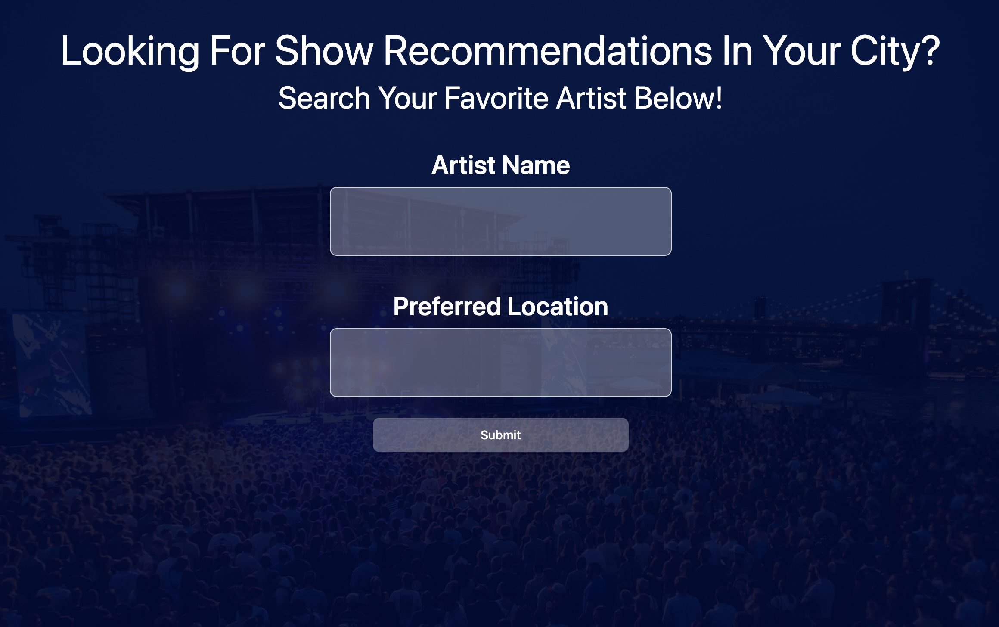

# New-Sounds-in-Town

## Description

- What was your motivation?
    Our motivation for this project was to collaborate on a project that would exceed a project that we could do indiviually. This project encompassed everything that we learned so far in class an utilize a framework that no one had before used. 

- Why did you build this project? 
    We built this project to utilize more capabilities of github, learn how to work on different branches and merge into main. To also learn how to utilize multiple server API's. 

- What problem does it solve?
    The project solves the problem of being able to find an event for an artist in a specific city that the user is intrested in. They can also see If the user sees that there are no events in that city from what they searched, the webpage also gives the user a list of artists that they might be intrested in. The user can click on one of the recommended artists and that will search for events for that the recommended artist. The user will then be able to find an event that they would be intrested in the case that thier initial artist is not playing in thier city of interest. 

- What did you learn?
    We learned how to divide tasks among different team members and use different branches, we learned how to deal with conflicts in github. We also learned how to impliment multiple server API's in order to create a new webpage that provide the user with a functional expierence. 

## Installation

Use the link below to access the webpage. 

https://alejandraquintero018.github.io/New-Sounds-in-Town-/

## Usage
 
This is how our webpage looks before the user enters an artist that they are interested in. 
   md

## Credits

Alejandra Quintero, Ben Hobson, Sankarsh Rajeev, Ivy, and Channing Johnson were all part of the planning, designing and building of this webpage. 

There was assistance from professor Diarmuid Murphy and Teaching assistant Meg Meyers for troubleshooting and guidance. 

There was also assistance from tutor Irina Kudosova. 

We used server API's from Seat Geek, Day.js and Taste Dive in the build of this project. Tailwind was used for the framework and styling of the webpage. 

## License

MIT License

Copyright (c) [2022] [fullname]

Permission is hereby granted, free of charge, to any person obtaining a copy
of this software and associated documentation files (the "Software"), to deal
in the Software without restriction, including without limitation the rights
to use, copy, modify, merge, publish, distribute, sublicense, and/or sell
copies of the Software, and to permit persons to whom the Software is
furnished to do so, subject to the following conditions:

The above copyright notice and this permission notice shall be included in all
copies or substantial portions of the Software.

THE SOFTWARE IS PROVIDED "AS IS", WITHOUT WARRANTY OF ANY KIND, EXPRESS OR
IMPLIED, INCLUDING BUT NOT LIMITED TO THE WARRANTIES OF MERCHANTABILITY,
FITNESS FOR A PARTICULAR PURPOSE AND NONINFRINGEMENT. IN NO EVENT SHALL THE
AUTHORS OR COPYRIGHT HOLDERS BE LIABLE FOR ANY CLAIM, DAMAGES OR OTHER
LIABILITY, WHETHER IN AN ACTION OF CONTRACT, TORT OR OTHERWISE, ARISING FROM,
OUT OF OR IN CONNECTION WITH THE SOFTWARE OR THE USE OR OTHER DEALINGS IN THE
SOFTWARE.
---
